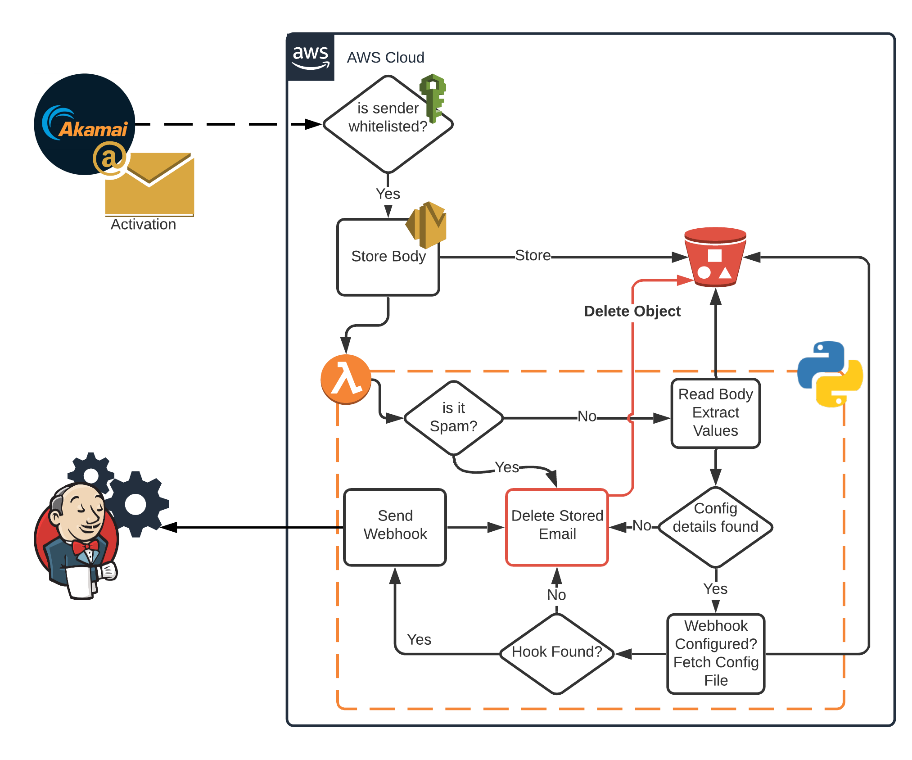
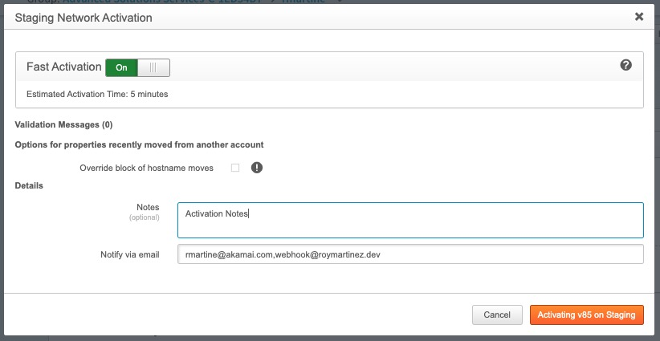
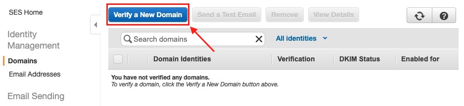
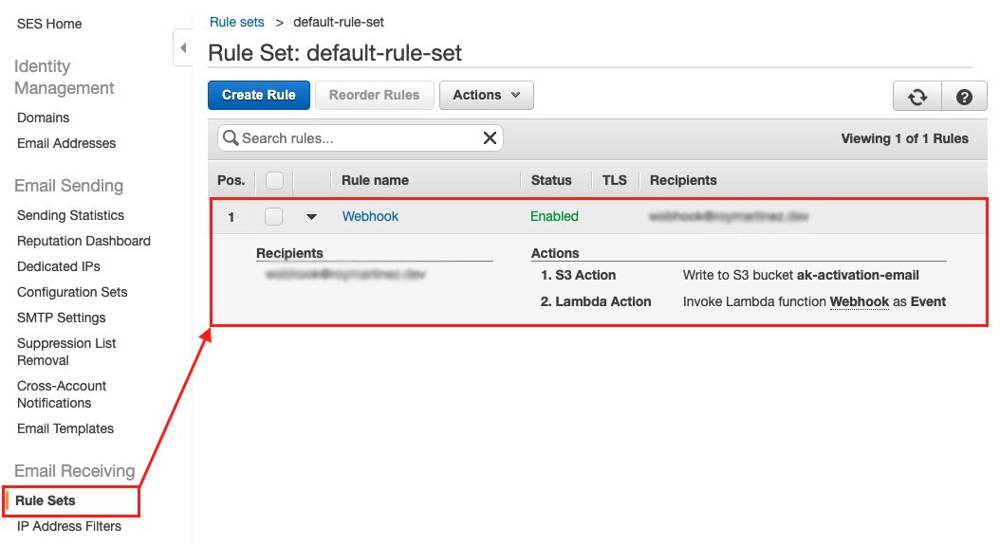

# AWS-Email-Webhook

TLDR; This project is meant to provide a reference Architecture to implement a email based webhook that would trigger Jobs/Builds on a system like `Jenkins`.

---

A challenge we face in DevOps, is when we can't notify/trigger a pipeline about a change on a system/service (ourside of our normal email activation notifications). Not having this capability is a challenge specially when Akamai Personal makes changes to a configuration making it `out of sync`. 

This solution will fill that void need by providing the `how to` and if there is interest we can also provide this as a servce(POC). In this example we will be receiving an Akamai Activation Notification, `process` it and trigger a webhook. 

### What it does:
* Receive and Extract details from email
* Identify Automated Activations
* Send Webhook
* Configure per Property Webhooks

### How it works:


This solution is made using AWS Services to quickly build the functionality needed:

* SES
* s3
* Lambda

AWS SES allows us to accept emails and to send them for processing. Lambda is then used to parse the email body (saved in AWS s3).

>Note: This example does not encrypt saved emails but you can do so within `SES`.

This function rejects spam, parses the email looking for details like Account Name, property name, network, who activated (Human or API), etc. Once we know for what account/config the notification is for we will look for any configured Webhook from a file also in s3.

Configured Webhook? For this POC that I've created is a `JSON` file that will live in s3, this file will have have any configured webhook for a give account/Property. The function once it has made sure its not spam and it has the details of the activation, using the same details it will look for any webhook under the same accountname and propetyname. Once it finds a webhook for the current activation it will make a network request `GET` to the URL and with the `HTTP` headers configured.

## Configuration Example

```json
{
  "accounts": [
    {
      "name": "Global Consulting Services",
      "proerties": [
        {
          "name": "roymartinez.dev",
          "endpoint": "http%3A%2F%2Fexample.com%2Fgeneric-webhook-trigger%2Finvoke%3Ftoken%3D<some-token>",
          "headers": { "Content-Type": "application/json" ,"User-Agent":"Webhook"}
        }
      ]
    }
  ]
}
```

## Usage

Once we have configured s3, SES, Lamda and IAM all we need to do is add the configured email to the notification list `webhook@example.com`.


---

# AWS Setup


 **S3** 

We need a bucket to store our messages, no special requieremnts for it except the policy to be used below.

Please use this guide if needed: [How to create a bucket](https://docs.aws.amazon.com/AmazonS3/latest/user-guide/create-bucket.html)


 **Lambda**

This is where most of the work goes, but for now just create a function ([update IAM policy](Policies/s3.policy.json)) and below we have a section on the script it self.

Part from that access needed there aren't much changes around the function (excluding the code). The only thing that was added was 2 test cases that are based on the `SES` Example:
* [Human](Examples/Human.Testemail.json) 
* [Automated](Examples/Human.Testemail.json)

If you compare them to the "Official" `SES` example the only change the have is the return paths that are used later in the code.

```"returnPath": "automated@example.com"```

```"returnPath": "human@example.com"```

[How to create a function](https://docs.aws.amazon.com/lambda/latest/dg/getting-started-create-function.html)


 **SES**

Once you have create/configured `s3` and `Lambda` we can now setup `SES`.

Steps:
1. [Validate your domain](https://docs.aws.amazon.com/ses/latest/DeveloperGuide/verify-domains.html). 
2. [Configure IAM Policy](https://docs.aws.amazon.com/ses/latest/DeveloperGuide/sending-authorization-policy-examples.html#sending-authorization-policy-example-from)
3. [Create a Rule set](https://docs.aws.amazon.com/ses/latest/DeveloperGuide/receiving-email-receipt-rule-set.htm) 


## IAM Policies

 **SES**

For SES I created a policy to limit who can send emails to this setup. In summary we need to add a contition for the sender and in our example its the noreply@akamai.com.
[Full SES IAM Policy Example](Policies/ses.policy.json)

```json
"Condition": {
    "StringEquals": {
        "ses:FromAddress": "noreply@akamai.com"
    }
}
```


 **S3**

SES will be storing the messages we need to give it permision to do so. [Full s3 IAM Policy Example](Policies/s3.policy.json)

```json
"Principal": {
  "Service": "ses.amazonaws.com"
},
"Action": "s3:PutObject",
"Resource": "arn:aws:s3:::<changeme>/*"
```


 **Lambda**

Lastly Lamdba needs invoked by `SES`. [Full Lambda IAM Policy Example](Policies/lambda.policy.json)

```json
"Principal": {
  "Service": "ses.amazonaws.com"
},
"Action": "lambda:InvokeFunction",
"Resource": "arn:aws:lambda:<changeme>",
```
---
# Lambda Funcion

---    
## Contribute

Want to contribute? Sure why not! just let me know!

## Author

Me https://roymartinez.dev/

## Licensing

I am providing code and resources in this repository to you under an open-source license. Because this is my repository, the license you receive to my code and resources is from me and not my employer (Akamai).

```
Copyright 2019 Roy Martinez

Creative Commons Attribution 4.0 International License (CC BY 4.0)

http://creativecommons.org/licenses/by/4.0/
```