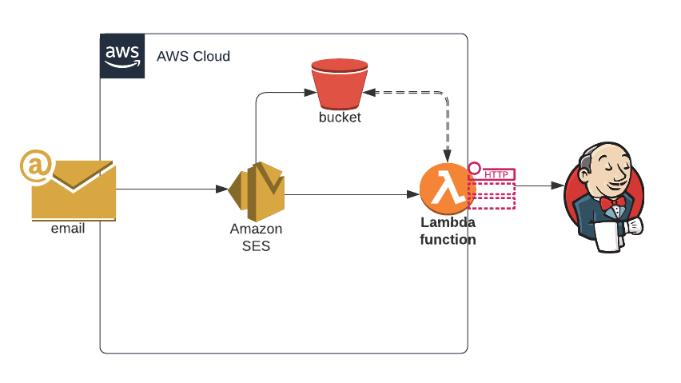

# AWS-Email-Webhook

TLDR; This project is meant to provide a reference Architecture to implement a email based webhook that would trigger Jobs/Builds on a system like `Jenkins`.

---

A challenge we face in DevOps, is that we can't notify a pipeline about a change on our configurations ourside of our normal email activation notifications. Not having this capability is a challenge specially when Akamai Personal makes changes to a configuration making it `out of sync`. 

This solution will fill that need by providing the `how to` and if there is interest we can also provide this as a POC. It receive Akamai Activation Notification `process` them and trigger a webhook. 

### What it does:
* Receive and Extract details from email
* Identify Automated Activations
* Send Webhook
* Configure per Property Webhooks

### How it works:

This solution is made using AWS Services to quickly build the functionality needed using AWS: 
* SES
* s3
* Lambda

AWS SES allows use to accept emails and to send them for processing. Lambda is used to parse the email body (saved in AWS s3) and send any configured. 

Configured? yup, so SES sends the body to s3 and then triggers a lambda funtion. This function rejects spam, reads the email looking for details like Account Name, property name, network, who activated (Human or API), etc. Once we know for what account/config the notification is for

Example usecase: Email based notifications, like Akamai Delivery Configuration Activation Email.


## Configuration 

```json
{
  "accounts": [
    {
      "name": "Global Consulting Services",
      "webhooks": [
        {
          "name": "roymartinez.dev",
          "endpoint": "http%3A%2F%2Fexample.com%2Fgeneric-webhook-trigger%2Finvoke%3Ftoken%3D7bf349ff546c43b9b62fb2b6e72f0a58",
          "headers": { "Content-Type": "application/json" ,"User-Agent":"Webhook"}
        }
      ]
    }
  ]
}
```
## Usage

webhook@roymartinez.dev