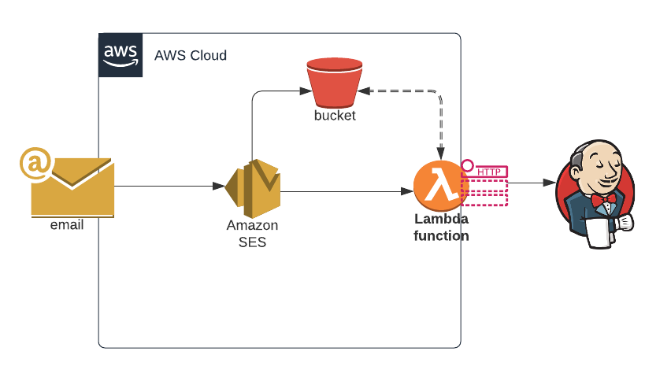

# AWS-Email-Webhook

## Description

This project is meant to provide a reference Architecture to implement a email based webhook that would trigger Jobs/Builds on a system like `Jenkins`.

Example usecase: Email based notifications, like Akamai Delivery Configuration Activation Email.

## Configuration 
## Usage